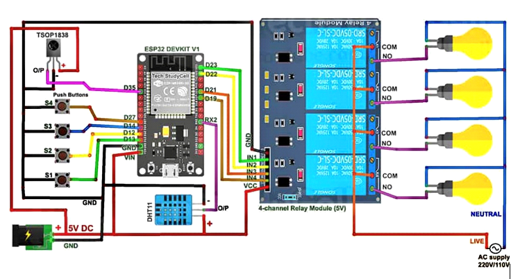
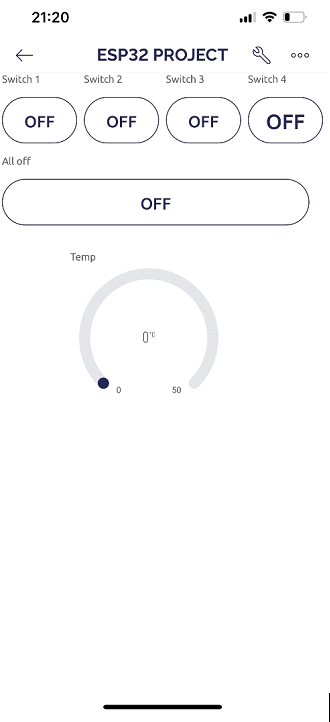
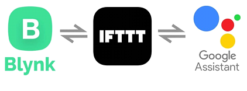
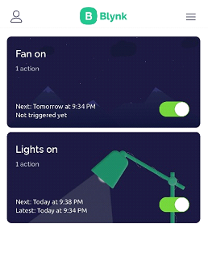
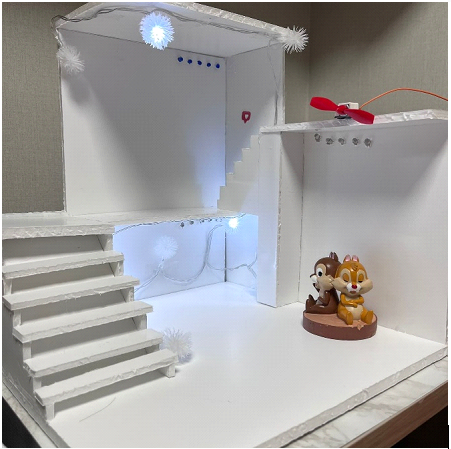

# Smart-Home-Using-IOT

## Project Overview

Project Name: Home Automation (Smart Home Using Internet of Things)

Participatory Department: Electronics Engineering, Electrical Engineering

Project Representative: Sai Navaneet

Participants:
- Corporation: 1
- Professor: 1
- Undergraduate students: 2 (Manisha Lingala, Navaneet)

Period: March 1, 2021, to July 31, 2021 (5 months)

Project Type: Middle

## Project Background

The concept of home automation has been around for a long time, with the vision of fully automated homes and robotic assistance in household chores. However, the technology required to realize these ideas was not readily available until recent times. The project aims to leverage IoT technology to build a working intelligent home application, starting from scratch. The idea of smart homes has been experimented with since the early 19th century, aiming to make lives more comfortable.

## Objectives and Content

The main objectives of the project are as follows:

1. Increase comfort and quality of life in the house
2. Enhance security and energy efficiency through remote-controllable equipment

To achieve these objectives, the following components are required:

- Relays
- Wi-Fi module (ESP32)
- Other basic electronic components

## Project Results

The project successfully achieved the following outcomes:

1. Built a model of a house with basic appliances such as lights and fans
2. Enabled remote control of these appliances through the cloud from anywhere in the world
3. Implemented four types of control methods:
    - Control through the cloud
    - Control through a mobile app
    - Voice control
    - Time-based control

## Circuit Diagram

Below is the circuit diagram of the smart home system:

The circuit diagram showcases the connectivity of various components involved in the project. It includes the relays, Wi-Fi module (ESP32), and other basic electronic components. This diagram provides a visual representation of how the different elements of the system are interconnected to enable the desired functionality.

## Control Methods

The project implemented three different control methods for operating the smart home system:

1. Control through the Cloud:

   

   This method allows users to control the smart home appliances using a web-based interface or application. Users can access the control interface through any internet-connected device, such as a computer or smartphone. It provides convenience and flexibility for managing the devices remotely, even in the absence of a mobile phone.

2. Control through Voice:

   

   Voice control was implemented using Google Assistant and the IFTTT (If This Then That) platform. Users can give voice commands to control the devices. By assigning specific voice commands for turning on or off the appliances, users can conveniently operate the smart home system using their voice.

3. Control through Timer:

   

   The timer control method enables users to schedule the activation of devices at specific times. Users can set a particular time for the devices to turn on automatically. This feature is useful for automating routines and ensuring that appliances are activated at desired times without manual intervention.

## Final Model

